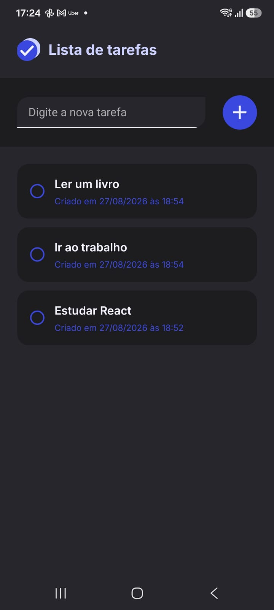
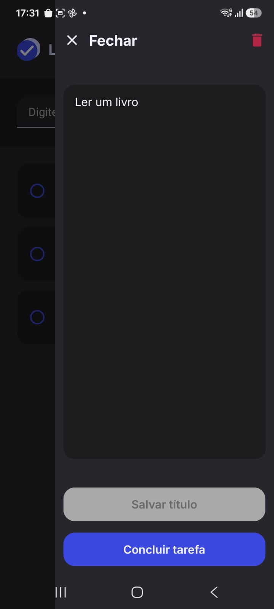

# 📝 Lista de Tarefas

Aplicativo mobile de gerenciamento de tarefas desenvolvido com **React Native + Expo**, com gerenciamento de estado utilizando **Redux** e persistência local através do **AsyncStorage**.

O projeto foi desenvolvido com foco em uma interface simples, responsiva e agradável, permitindo criar, editar, concluir, reabrir e excluir tarefas.

---

## ✨ Funcionalidades

* ✅ Criar novas tarefas
* ✏️ Editar o título das tarefas
* ✔️ Concluir e reabrir tarefas
* 🗑️ Excluir tarefas com confirmação
* 💾 Persistência local das tarefas
* 📱 Interface adaptada para dispositivos móveis
* 🌙 Suporte a tema claro/escuro do sistema
* 🎨 Interface construída com componentes reutilizáveis
* ↔️ Drawer lateral para gerenciamento individual da tarefa
* 📜 Suporte a títulos longos com rolagem
* ⚡ Animações de abertura e fechamento do Drawer

---

## 📱 Interface

> Screenshots do aplicativo

|                     Tela inicial                    |                      Drawer da tarefa                     |
| :-----------------------------------------------------: | :-------------------------------------------------------: |
|  |  |

---

## 🛠️ Tecnologias

### Mobile

* **React Native**
* **Expo**
* **Expo Router**
* **TypeScript**

### Gerenciamento de estado

* **Redux Toolkit**
* **React Redux**
* **Redux Persist**

### Persistência

* **AsyncStorage**

### Interface

* **React Native Animated**
* **Material Icons**
* **Expo Fonts**
* **React Native Safe Area Context**

### Tipografia

* **Inter**

---

## 🏗️ Arquitetura

O projeto utiliza uma separação baseada em componentes, modelos e gerenciamento centralizado de estado.

```text
todo-list/
│
├── app/
│   └── _layout.tsx
│
├── assets/
│   └── images/
│
├── components/
│   ├── Drawer.tsx
│   ├── TaskItem.tsx
│   ├── TaskList.tsx
│   └── Toolbar.tsx
│
├── models/
│   └── task.ts
│
├── store/
│   ├── index.ts
│   └── tasks-slice.ts
│
├── themes/
│   └── theme.ts
│
├── app.json
├── package.json
└── tsconfig.json
```

## 💾 Persistência local

As tarefas são armazenadas localmente utilizando:

**Redux Persist → AsyncStorage**

Sempre que o estado das tarefas é alterado, o Redux Persist persiste o estado no armazenamento local do dispositivo.

Ao iniciar o aplicativo novamente, o estado é reidratado automaticamente antes da aplicação ser renderizada através do `PersistGate`.

```text
Redux Store
     │
     ▼
Redux Persist
     │
     ▼
AsyncStorage
     │
     │ app reiniciado
     ▼
Rehydration
     │
     ▼
Redux Store restaurada
```

Dessa forma, as tarefas continuam disponíveis mesmo depois de fechar e abrir o aplicativo.

---

## 🎯 Modelo de tarefa

Cada tarefa possui a seguinte estrutura:

```ts
type TaskModel = {
  id: string;
  title: string;
  isDone: boolean;
  createdAt: string;
};
```

| Campo       | Tipo      | Descrição                        |
| ----------- | --------- | -------------------------------- |
| `id`        | `string`  | Identificador único da tarefa    |
| `title`     | `string`  | Título da tarefa                 |
| `isDone`    | `boolean` | Indica se a tarefa foi concluída |
| `createdAt` | `string`  | Data e hora de criação           |

---

## 🔄 Operações disponíveis

O Redux Slice disponibiliza quatro operações principais:

```ts
addTask(title)
updateTask({ id, title })
toggleTask(id)
deleteTask(id)
```

### Criar

```ts
dispatch(addTask("Estudar React Native"));
```

### Editar

```ts
dispatch(
  updateTask({
    id,
    title: "Estudar React Native e Redux",
  }),
);
```

### Concluir/Reabrir

```ts
dispatch(toggleTask(id));
```

### Excluir

```ts
dispatch(deleteTask(id));
```

---

## 🎨 Componentes

### `Toolbar`

Responsável pela criação de novas tarefas.

Possui:

* Campo de texto
* Validação de título vazio
* Botão de adicionar
* Suporte ao envio pelo teclado

---

### `TaskList`

Responsável pela renderização da lista utilizando `FlatList`.

Também possui um estado visual para quando nenhuma tarefa foi cadastrada.

---

### `TaskItem`

Representa individualmente uma tarefa.

Exibe:

* Status da tarefa
* Título
* Data de criação

Tarefas concluídas recebem uma representação visual diferente.

---

### `Drawer`

Painel lateral utilizado para gerenciamento de uma tarefa específica.

Permite:

* Editar título
* Salvar alterações
* Concluir tarefa
* Reabrir tarefa
* Excluir tarefa
* Fechar o painel

O Drawer utiliza `Animated` para realizar a transição lateral.

---

## 🚀 Como executar

### Pré-requisitos

Tenha instalado:

* [Node.js](https://nodejs.org/)
* npm
* Android Studio **ou** Expo Go
* Git

---

### 1. Clone o repositório

```bash
git clone https://github.com/SEU_USUARIO/todo-list.git
```

Entre na pasta:

```bash
cd todo-list
```

---

### 2. Instale as dependências

```bash
npm install
```

---

### 3. Inicie o projeto

```bash
npm start
```

Ou:

```bash
npx expo start
```

---

## 📱 Executando no Android

Para executar utilizando uma development build:

```bash
npx expo run:android
```

Caso tenha alterado configurações nativas do Expo:

```bash
npx expo prebuild --clean
npx expo run:android
```

---

## 🧹 Limpar o cache

Caso o Metro apresente algum comportamento inesperado:

```bash
npx expo start -c
```

---

## 📦 Build

Para gerar uma build utilizando EAS:

```bash
eas build
```

Para Android:

```bash
eas build --platform android
```

---

## 📌 Próximos passos

Algumas funcionalidades que podem ser adicionadas futuramente:

* [ ] Categorias de tarefas
* [ ] Prioridade das tarefas
* [ ] Data de vencimento
* [ ] Filtros
* [ ] Ordenação
* [ ] Busca de tarefas
* [ ] Notificações
* [ ] Sincronização com backend
* [ ] Autenticação de usuários
* [ ] Persistência em banco de dados
* [ ] Testes unitários
* [ ] Testes de componentes

---

## 📚 Objetivo do projeto

Este projeto foi desenvolvido como uma aplicação prática para explorar conceitos de desenvolvimento mobile com **React Native e Expo**, especialmente:

* Gerenciamento de estado global
* Redux Toolkit
* Persistência de estado
* Componentização
* TypeScript
* Animações
* Navegação e overlays
* Manipulação de formulários
* UX para aplicações mobile

---

## 👨‍💻 Autor

**Gabriel Torres**

Desenvolvedor Full Stack com experiência em aplicações web e mobile.

### Tecnologias

```text
TypeScript • JavaScript • React Native • Expo
Node.js • NestJS • Next.js • Angular
PostgreSQL • SQL Server • Prisma
Docker • Firebase • Supabase
```

---

## 📄 Licença

Este projeto está disponível sob a licença **MIT**.

Sinta-se livre para estudar, modificar e utilizar o código.
